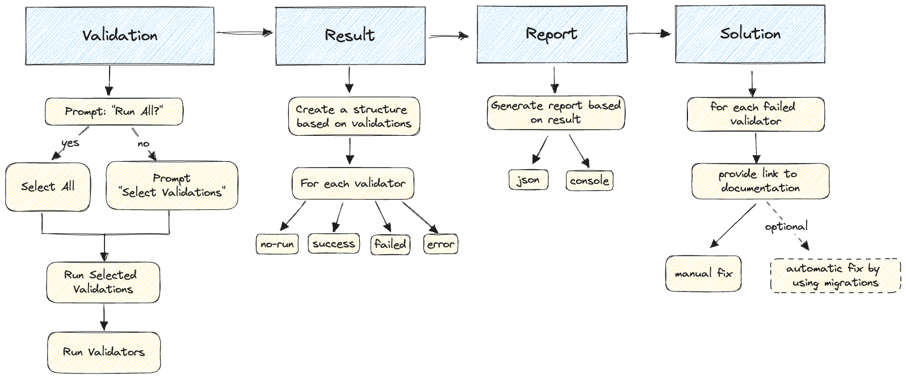
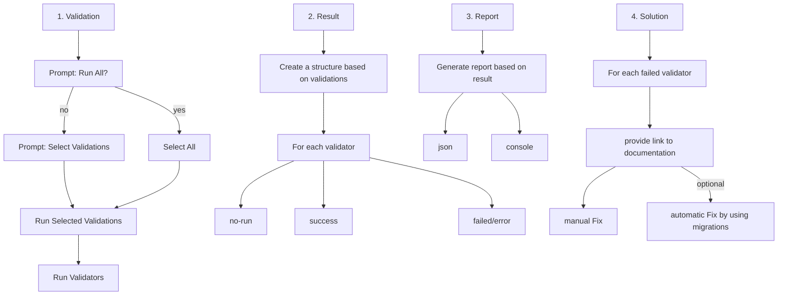

# Workspace Validation

## Getting Started

Workspace validation utilizes the power of [Nx generators](https://nx.dev/core-features/plugin-features/use-code-generators) behind the scenes. To initiate the migration validation, run the following command:

```
nx g @nx-validators/migration-kit:validate-workspace
```

## How does it work?




### 1) Validation Phase

**The first phase** is responsible for running all generators that verify if the workspace adheres to the rules and conventions specified in the **Internal Nx Framework**.

The validators dictionary structure looks like this:

```typescript
export const WORKSPACE_VALIDATIONS: WorkspaceValidation = {
    'validation-one': {
        name: 'Validation One',
        description: 'Validate multiple rules to align a context',
        validatorIds: ['validator-one', 'validator-two'],
    },
    'validation-two': {
        name: 'Validation Two',
        description: 'Validate multiple rules to align a context',
        validatorIds: ['validator-three'],
    },
};
```

The structure explained:

-   A `Workspace Validation` consists of multiple `Validation` sets.
-   A `Validation` represents a state that needs to be followed to be compliant with the **Internal Nx Architecture**.
-   A `Validator` is implemented as an [Nx generator](https://nx.dev/core-features/plugin-features/use-code-generators) and validates one specific rule. It includes documentation with explanations and solutions to address the `Validation`.

For the complete implementation of this structure, refer to the file [workspace-validations.ts](packages/migration-kit/src/workspace-validation/validate-workspace/workspace-validations.ts).

### 2) Result Phase

**The second phase** provides the output of the first phase. It generates a result for each validator, allowing us to report and propose solutions for failed validations.

The result structure is as follows:

```typescript
const result = {
    created: 1690288298447,
    validationResults: {
        'validation-one': {
            name: 'Validation One',
            description: 'Validate multiple rules to align a context',
            status: 'failed',
            validatorResults: {
                'validator-generator-id-one': {
                    status: 'failed',
                    data: ['Validator started', 'Cannot find file test.ts', 'Validator failed'],
                    documentation:
                        'packages/migration-kit/src/workspace-validation/validators/validator-generator-id-one/README.md',
                },
                'validator-generator-id-two': {
                    status: 'success',
                    data: ['Validator started', 'Workspace is respecting the lint configurations'],
                    documentation:
                        'packages/migration-kit/src/workspace-validation/validators/validator-generator-id-two/README.md',
                },
            },
        },
        'validation-two': {
            name: 'Validation Two',
            description: 'Validate multiple rules to align a context',
            status: 'success',
            validatorResults: {
                'validator-generator-id-three': {
                    status: 'failed',
                    data: ['Validator started', 'Cannot request the server http://....', 'Validator error'],
                    documentation:
                        '/tree/master/Client/migration-kit/src/workspace-validation/validators/validator-generator-id-thee/README.md',
                },
            },
        },
    },
};
```

### 3) Report Phase

Based on the above result, we can generate a list of reports. You can configure the reports when executing the `validate-workspace` generator:

```
nx g @nx-validators/migration-kit:validate-workspace --reports=json,console
```

The available report formats are:

-   `JSON`: The json report mirrors the structure of the result above.
-   `CONSOLE`: The console report also displays the result in a similar format.

Additional report formats like `HTML` and `Markdown` are yet to be implemented.

### 4) Solution Phase

Following the validation result, for each `Validator` that failed, we propose documentation related to the `Validator` containing solutions to address the issues.

You can find the list of Validators and documentation here: [Validators List](packages/migration-kit/src/workspace-validation/validators/README.md)
