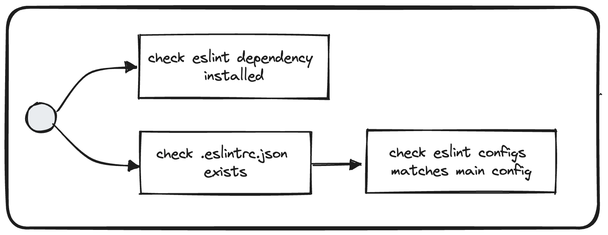

# Check ESLint Configs

## Description
This validator checks for the `eslint` package existence in the target's project repository. It also compares eslint configuration with the expected one, and generates a report with the diff object of the configurations.

## Solution
* Install `eslint`: `yarn add eslint -D`
* Align `.eslintrc.json` located at the root of your repository with the [main configuration](`https://vie.git.bwinparty.com/vanilla/monorepo/-/blob/f2e9486bb3d3b2adfd5d8f728d06307d4c049614/.eslintrc.json`)

