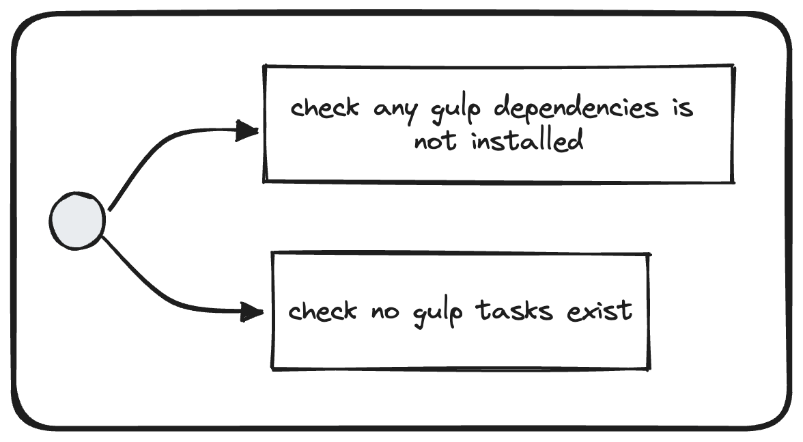

# Check Gulp Usage

## Description
In a Nx architecture, Gulp is not needed anymore because [Nx Tasks](https://nx.dev/core-features/run-tasks) will be used instead to standardize the executions you can have on each project.

## Solutions
* Replace Gulp tasks with existing [Nx Executors](https://nx.dev/packages)
* Check Vanilla repository for example
* Remove all Gulp dependencies
