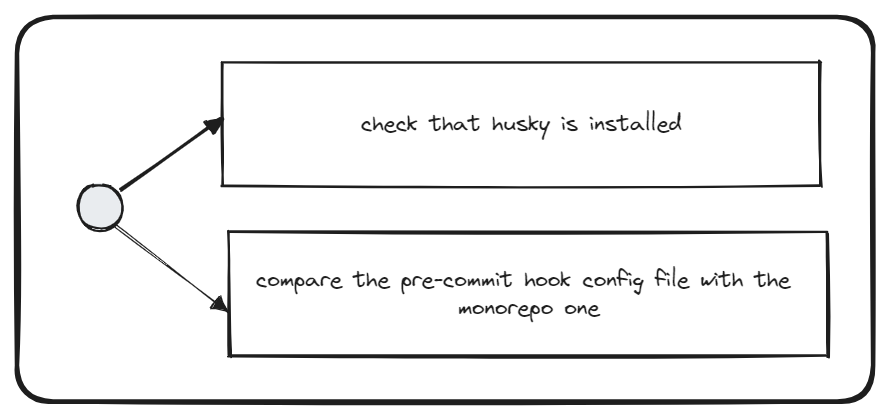

# Check Husky Config


## Description
This validator checks whether the `husky` dependency is installed and whether the pre-commit hook is configured correctly. 

## Solutions
* Install `husky` and `lint-staged` dependency
* Add pre-commit config file to the `.husky` folder in the project root
* Configure the pre-commit hooks just like in the Monorepo
* Extend your `lint-staged.config.js` configuration as follows:
```js
module.exports = {
    ...require('@nx-validators/dev-kit/src/lint-staged/index'),
    // here comes your custom configuration
};
```
