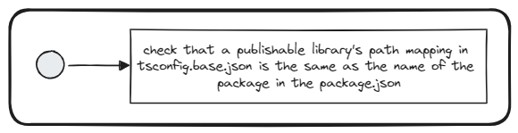

# Check Import Aliases

## Description
This validator checks whether the tsconfig.base.json path mapping of a publishable library matched the package name defined in the package.json file of the library.

## Solutions
* Refactor your imports to align the path mapping with the publishable package name