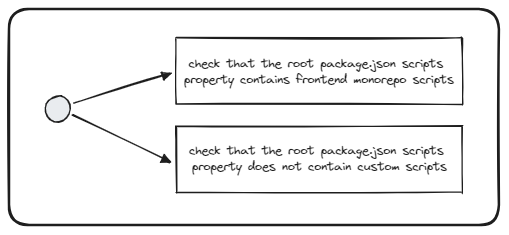

# Check Nx scripts in package.json

## Description
This validator should compare the root package.json scripts with the frontend monorepo ones.

## Solutions
* Remove custom scripts
* Add common Nx scripts from the frontend monorepo
