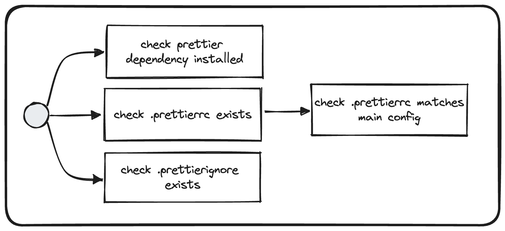

# Check Prettier Configuration

## Description
The goal of that validator is to check that prettier is correctly configured in the current repository.
The prettier configuration is centralized in the dev-kit of the Frontend Nx Framework.

## Solutions
* Install prettier `yarn add prettier -D`
* Ensure `.prettierrc` located at the root of your repository is using the [shared-configuration](`https://vie.git.bwinparty.com/vanilla/monorepo/-/blob/main/packages/dev-kit/src/prettier/index.js`) by using the plugin `@frontend/dev-kit`
* Align `.prettierignore` located at the root of your repository with the [main configuration](`https://vie.git.bwinparty.com/vanilla/monorepo/-/blob/main/.prettierignore`)
