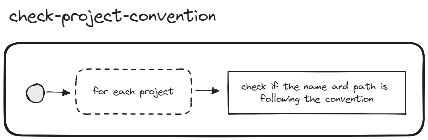

# Check Project Convention

## Description
The goal of this validator is to ensure projects name and path are following the convention so we can identify their type easily.

## Solutions
Projects name and path should follow the following convention `*-{SUFFIX}` where SUFFIX can be one of the following type:

- **app** eg: `themepark-app`
- **utils**, eg: `themes-data-utils`
- **kit**, eg: `dev-kit`
- **nx-plugin**, eg: `themepark-nx-plugin`
- **theme**, eg: `themepark-betboo-theme`
- **lib**, eg: `vanilla-lib`
- **feature**, eg: `vanilla-account-menu-feature`
- **ui**, eg: `vanilla-account-menu-ui`
- **data-access**, eg: `vanilla-account-data-access`
- **storybook**, eg: `design-system-storybook`

The name is defined in the `project.json` file at the project root.
The path is computed from the workspace root to the `project.json` file.