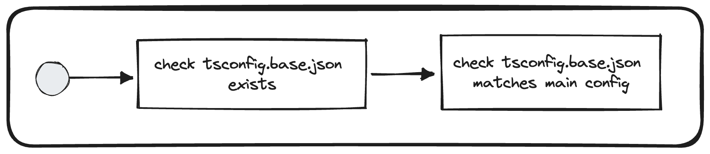

# Check root tsconfig.base.json

## Description
The goal of that validator is to check that the main typescript configurations is correctly configured in the current repository.

## Solutions
* Check that `tsconfig.base.json` exists
* Align `tsconfig.base.json` located at the root of your repository with the [main configuration](`https://vie.git.bwinparty.com/vanilla/monorepo/-/blob/main/tsconfig.base.json`)

