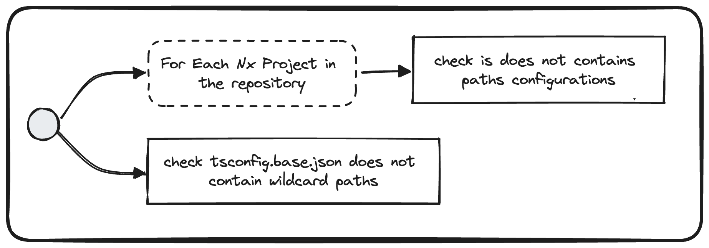

# Check tsconfig paths


## Description
This validator checks that the main typescript configuration is containing valid path configurations. To do so, wildcard paths are not allowed.
It checks also if nested typescript configuration are not declaring paths. In fact, all paths should be declared in the main `tsconfig.base.json`

## Run

```bash
nx generate @frontend/migration-kit:check-tsconfig-paths
```

## Solution
* Remove wildcard paths from your main `tsconfig.base.json`.
* Ensure that nested `tsconfig.json`, `tsconfig.app.json`, `tsconfig.spec.json`, `tsconfig.lib.json` are not containing any paths configuration. If it is the case, move these paths to the main `tsconfig.base.json`.
