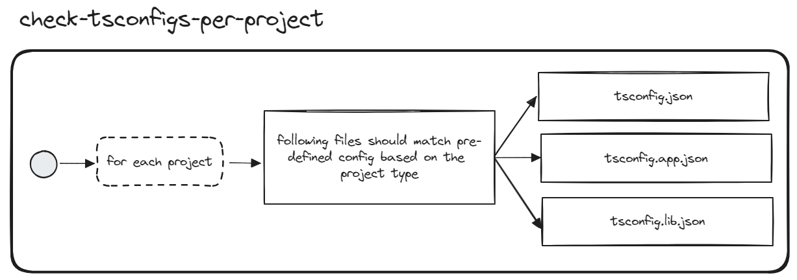

# Check tsconfig per project

## Description
This validator checks tsconfig on the project level.

## Solution
* Ensure that nested `tsconfig.json`, `tsconfig.app.json`, `tsconfig.spec.json`, `tsconfig.lib.json` contain default compiler options generated automatically by appropriate nx lib generator.
