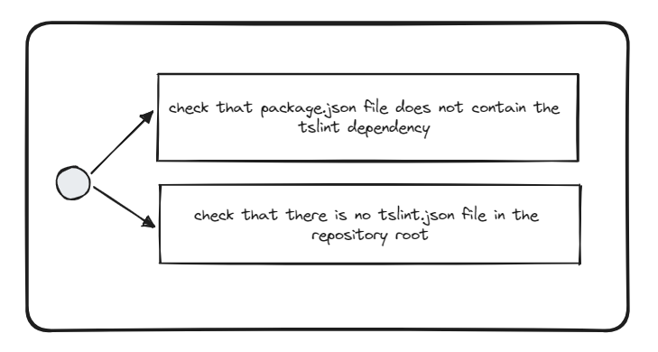

# Check TSLint is not used

## Description
This validator checks whether the repository has no `tslint` dependency installed and configured. 

## Solutions
* remove `tslint` dependency from your `package.json` file
* remove `tslint.json` configuration file if it exists