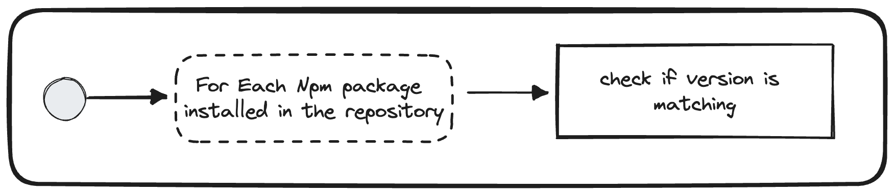

# Check Version Mismatch


## Description
This validator checks that all the packages that are used in the repository are aligned with the dependency from the monorepo dependencies.

## Run

```bash
nx generate @frontend/migration-kit:check-version-mismatch
```

## Solutions
* Align `package.json` located at the root of your repository with the [main configuration](`https://vie.git.bwinparty.com/vanilla/vanilla/-/blob/f2e9486bb3d3b2adfd5d8f728d06307d4c049614/.package.json`)
* `IF` a dependency is lower than the one on the monorepo, upgrade it.
* `IF` a dependency is higher than the one on the monorepo, inform Vanilla team that we should upgrade it.