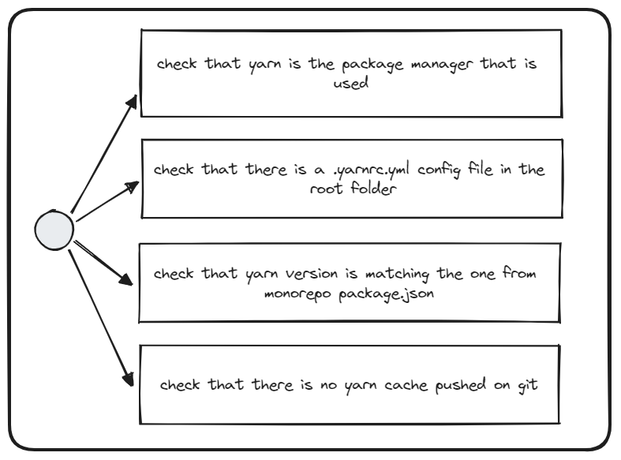

# Check Yarn Config

## Description
This validator checks that the repository is using `yarn` as the package manager and that it's configured correctly.

## Solution

1. Use `yarn` as the package manager
2. Add `packageManager` property to your `package.json` and specify its version
3. Create and align the `.yarnrc.yml` config file in the root folder of your repository
