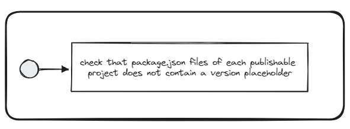

# No package.json placeholder

## Description
This validator checks that a project's `package.json` file does not contain any placeholders instead of a real version number.

## Solution

1. Remove placeholders from the project's `package.json` file and replace it with a wildcard or with the actual package version