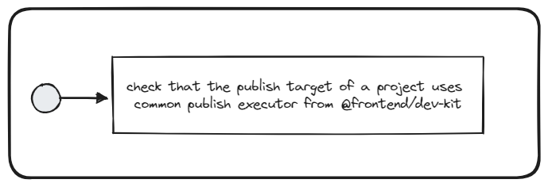

# Use Common Publish Target


## Description
This validator checks if projects are using common publish executor from the `@frontend/nx-plugin` plugin.

## Solution

1. Make sure to have `@frontend/nx-plugin` dev dependency installed and up to date
2. Define the custom publish target in the project.json of each publishable library/application (please the see code snippet below).
3. [OPTIONAL] (Local Registry Setup) Install `verdaccio` package and configure `config.yml` inside the `.verdaccio` folder in the root

```jsonc
{
    "targets": {
        // ...
        "publish": {
            "executor": "@frontend/nx-plugin:publish",
            "configurations": {
                "artifactory": {},
                
                /* THIS PART IS OPTIONAL */
                "verdaccio": {
                    "dest": "http://localhost:4873/"
                },
                "path": {
                    "dest": "$VANILLA_SYNC_TARGET"
                }
                /*************************/ 
                
            },            
            "defaultConfiguration": "artifactory"                        
        }
    }
}
```
