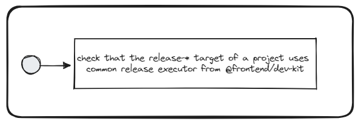

# Use Common Release Target


## Description
This validator checks if projects are using common release executor from the `@frontend/nx-plugin` plugin.

## Solution

1. Make sure to have `@frontend/nx-plugin` dev dependency installed and up to date
2. Define the custom release target in the `project.json` of each publishable library/application `project.json` (please the see code snippet below).

```jsonc
{
    "name": "workspace",
    // ...
    "targets": {
        // ...
        "release-${projectGroup}": {
            "executor": "@frontend/nx-plugin:release",
            // ...
        }
    }
}
```
