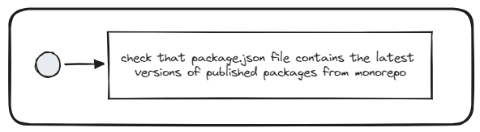

# Use latest monorepo packages

## Description
This validator checks that all the monorepo packages that are used in the repository are up to date.

## Solutions
* Upgrade packages that are not up to date.