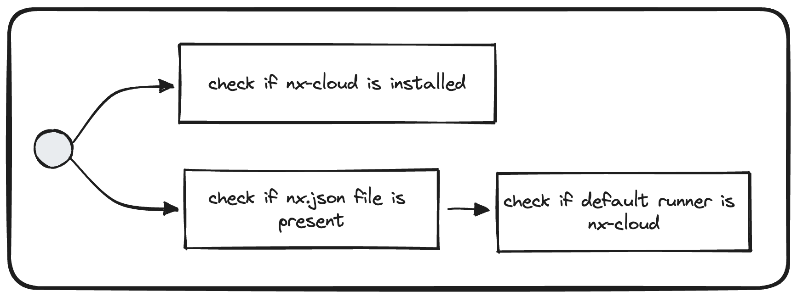

# Use Nx Cloud



## Description
This validator checks that the workspace is using Nx Cloud.

## Run
```bash
nx generate @frontend/migration-kit:use-nx-cloud
```

## Solution

1. Ensure you have the default configuration in nx.json

```json
{
  "tasksRunnerOptions": {
        "default": {
            "runner": "nx/tasks-runners/default",
            "options": {
                "cacheableOperations": ["build", "lint"]
            }
        }
    }
}
```

2. Then you can connect your workspace by using the command:

```shell
NX_CLOUD_API="http://nxcloud.dev.env.works" npx nx connect
```