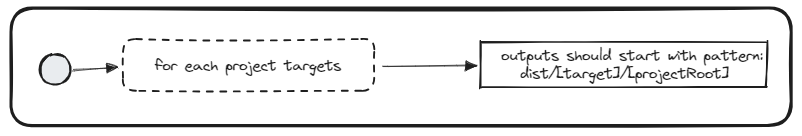

# Use output dist

## Description
This validator checks whether each target's `outputs` array in project.json contains a path that is equal to `{workspaceRoot}/dist/${target}/{projectRoot}`.

## Solution
For each `project.json` target with `outputs`
 property defined (usually related to `build`, `test`, and `lint` targets):
  - add a path that is equal to `{workspaceRoot}/dist/${target}/{projectRoot}`, where `${target}` is name of the current target