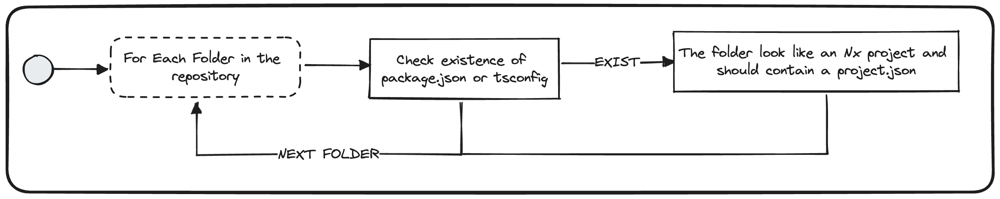

# Use project.json Files


## Description
This validator checks that everything that could be considered as a Nx project should contain a file `project.json`.

## Run
```bash
nx generate @frontend/migration-kit:use-project-json
```

## Solution
* Create a `project.json` file for each library/application within the repository
* You can apply these conditions on the folder structure within the project repository:
  - `IF` there is a `package.json`, there should be a `project.json`
  - `IF` there is a `tsconfig.json`, there should be a `project.json`
  - `ELSE` any other directory that is considered as a project (for example a back-end folder) should contain a `project.json`