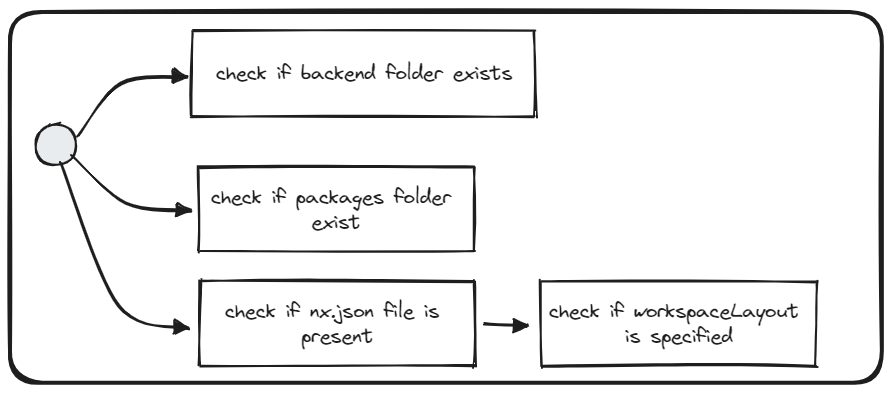

# Use workspace folder structure


## Description
This validator checks whether a workspace folder structure fits the monorepo one.

## Solution
* Create a `backend/` folder in the root, and move all backend-related files there
* Create a `pacakages/` folder in the root, and move all domain-related frontend code there (client apps and libs)
* In the `nx.json` file in the workspace root, specify `workpsaceLayout` property as follows: 

```json5
{
    workspaceLayout: {
        appsDir: "packages",
        libsDir: "packages"
    }
}
```

Please see the vanilla repository structure ([link](https://vie.git.bwinparty.com/vanilla/monorepo)) and [Nx Docs](https://nx.dev/reference/nx-json) for more information.