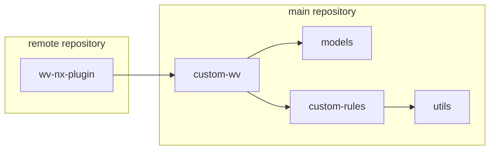
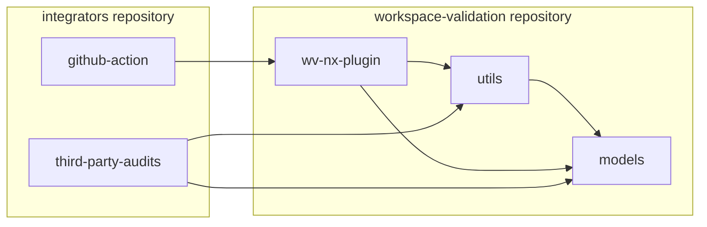

# Package `workspace-validation` (or short `wv`)

## Target Audience/Main Usage

**There are 2 target groups:**
- `I`) People that want to validate their workspace named `main-workspace` (or short `M`)
- `II`) People want to sync with another workspace thies workspace is named `remote-workspace` (or short `R`)

### Setup for `I`

**Default Setup in `M`:**  
1. Install the `workspace-validation` package from NPM in `M`.  
   The package including all public validators
2. Set up a `workspace-validations.config.ts` and add the general rules from `wv`
3. Run  `npx workspace-validation validate`  
3.1. All validations mentioned in `workspace-validations.config.ts` are executed   
3.2. The defined `report.[ext]` files are generated / printed to console 
3.3. Optionally, he generated report data are sent to the dashboard

**Custom Rules in `M`:**  
1. Create a generator for the `validation` and optional `fix` code
2. Add the custom rule name to the `workspace-validations.config.ts`
3. The next run of the `workspace-validation` package will include the custom rule

### Setup for `II`

**Default Setup in `R`:**
- All steps form "Default Setup" and "Custom Rules" under "Setup for `I`"

**Custom Rules in `R`:**
- This n/a as the custom rules will live in `M` and installed over NPM

**Prepare `M`:**
1. Publish your `workspace-validations.config.ts` from `M` as a NPM package e.g. `my-repo-rules`   
1.1. Including the custom rules in the package and `workspace-validations.config.ts`

**Configure Target `R`:**  
1. Install the custom package e.g. `my-repo-rules` in `R`
2. Configuration of `workspace-validations.config.ts`  
2.1. Point to the target repository `M`  
2.2. Point to the target package of validators `M`  
3. Add the rules from `my-repo-rules` maintained in `M` to your `workspace-validations.config.ts` in `R`

## Potential Improvements

- The manual configuration of the validators could be automated through a generator e.g. `nx g workspace-validation:scann-validators --target=./my/validators`.  
  This could crawl the target folder and build the validator config.  
- The manual setup of a project in `R` that hosts the `workspace-validations.config.ts` and publishes a NPM package could be automated or supported.

## Package Structure

The main package is a Nx plugin and a set of confugurable audits 

The project should countain:
- utils - shared logic
- models - types, parsing
- nx-plugin - the main package as Nx generator

